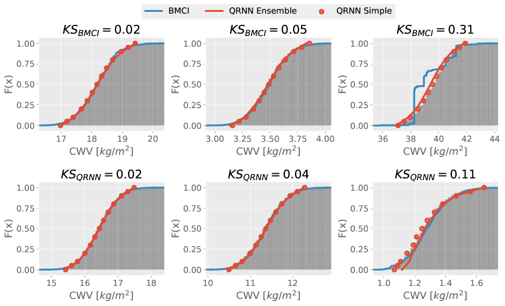

# A validation study for the application of quantile regression neural networks to Bayesian remote sensing retrievals

This repository contains a study that investigates the applicability of quantile
regression neural networks (QRNNs) for retrieving Bayesian a posteriori
distributions of remote sensing retrievals.

## Summary

The aim of the study is to assess the capability of quantile regression neural
networks to estimate the a posteriori distribution of Bayesian data retrievals.
To this end, a synthetic retrieval of integrated column water vapor (CWV) from
passive microwave satellite observations has been setup and simulated. The
retrieval is based on a climatology fitted to ERA Interim reanalysis data and uses
the ARTS radiative transfer simulator for the generation of training and test
data. The probabilistic predictions obtained from the QRNN are compared to
retrievals performed using MCMC simulations as well as another state-of-the-art
Bayesian retrieval method based on importance sampling of sample from a
retrieval database (BMCI)

## Files

### Python Source File

- **atms.py**: General code for the setup of the retrievals. The retrievals use channels
  of the ATMS sensor, which explains the name of the file.
- **matplotlib_settings.py**: Python module containing code used to setup the Matplotlib
   plotting environment.

### Notebooks
- **era_interim_climatology.ipynb**: Fitting of the climatology that represents the a prioi assumptions for the retrieval
- **era_interim_download.ipynb**: Download of the ERA Interim climatology data upon which this study is based
- **mcmc_retrievals_test.ipynb**: Test notebook to run MCMC retrievals locally.
- **mcmc_retrievals_test.ipynb**: Distributed MCMC retrievals using ipyparallel.
- **qrnn_model_selection.ipynb**: Hyperparameter tuning - **qrnn_training.ipynb**: Training of the QRNN used in the study
- **qrnn_training.ipynb**: Training of the QRNN
- **sensitivity.ipynb**: Sensitivity study to determine a good combination of channels for the CWV retrieval.
- **training_data.ipynb**: Creates training and test data for BMCI and QRNN.

### Folders
- **article**: Manuscript for the article for this work
- **data**: Data folder
- **plots**: Plots generated from evaluation
- **tables**: Table data generated from model selection notebooks.
